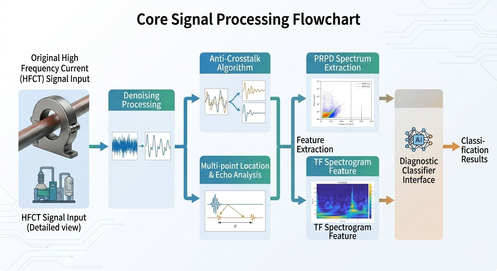
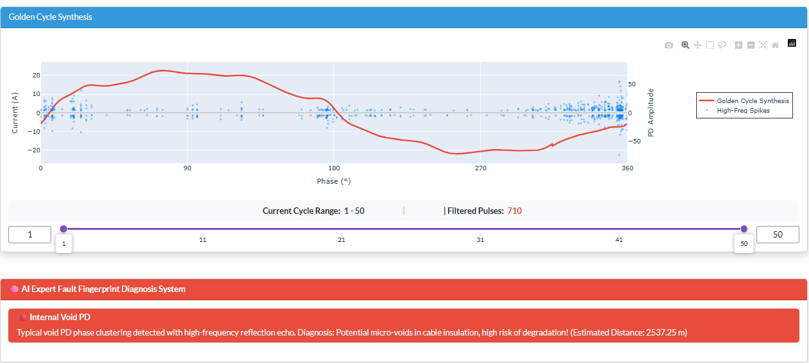
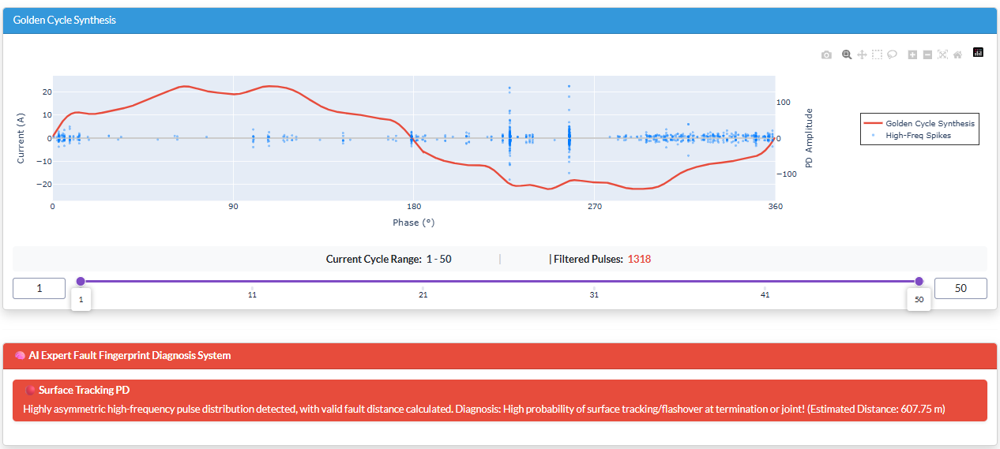
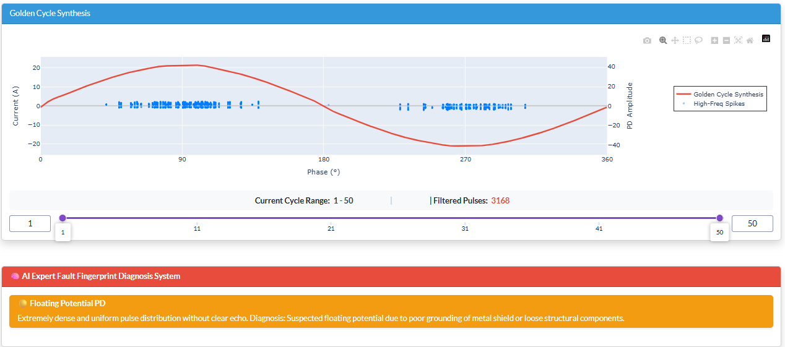
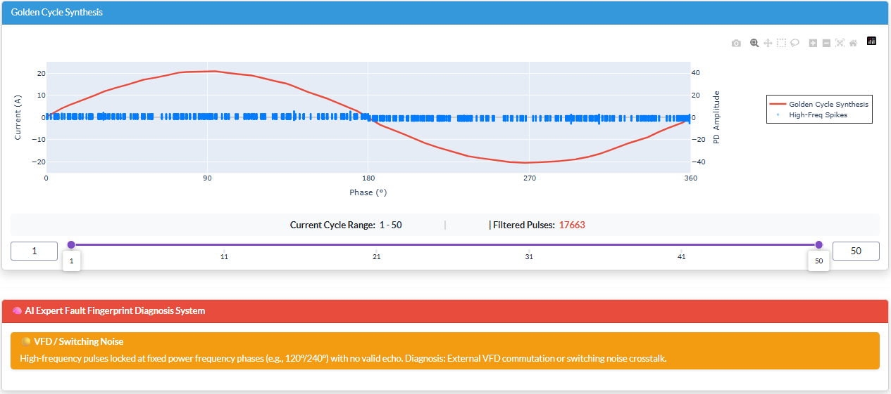
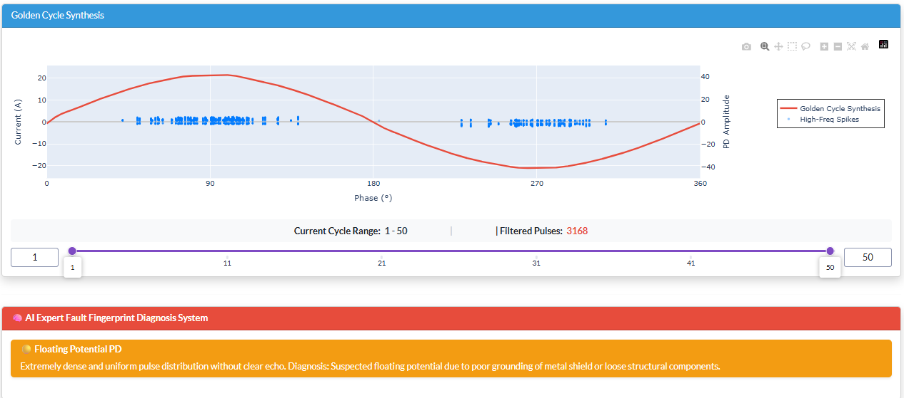

# ⚡ HE-PDA: Edge-Native High-Frequency PD Analysis Platform
## Technical Whitepaper & Specifications

**HE-PDA (High-Frequency Edge-Side Partial Discharge Analyzer)** is a professional-grade diagnostic system for high-frequency transient signal processing and Partial Discharge (PD) analysis. This document details the system architecture, core algorithm specifications, and expert diagnostic benchmarks.

---

## 🏢 Section 1: System Overview & Architecture

### 1. Product Positioning
Traditional PD monitoring relies on bulky industrial PCs for high-frequency data processing. **HE-PDA** shifts this paradigm with a lightweight, optimized architecture that moves electromagnetic transient feature extraction directly to the edge. By processing raw physical phenomena into automated, actionable data on-site, it provides a reliable and scalable solution for high-voltage cable and power equipment health assessment.

### 2. Software & Deployment Specifications
*   **Frontend Rendering**: Built on React with Plotly WebGL hardware acceleration. Capable of rendering millions of data points per chart with zero lag during deep drill-down analysis.
*   **Analysis Engine**: High-performance scientific computing stack built in Python (SciPy / NumPy / Pandas).
*   **Deployment**: Native Docker support (`Dockerfile` included) for one-click deployment to Linux/Windows servers or edge gateways, ensuring consistent environment isolation.

  
   <em>▲ Fig 1: End-to-end data flow from edge acquisition to core analysis and cloud/local visualization.</em>

### 3. Integrated Standard Datasets
The system comes pre-loaded with standard three-phase PD waveforms captured at an 80MHz sampling rate (including internal voids, environmental noise, etc.). Users can load these samples instantly or **download raw CSVs** for offline analysis. This "out-of-the-box" capability facilitates rapid algorithm verification and hardware selection benchmarking.

> **🔗 Dataset Expansion**: For R&D and machine learning, the platform is compatible with high-resolution open datasets. Access **8,000+ sets of 80MHz single-cycle waveforms** via [Kaggle (VSB Power Line Fault Detection)](https://www.kaggle.com/competitions/vsb-power-line-fault-detection/data) or the [Author's Google Drive](https://drive.google.com/drive/folders/1GH7KxsQyumzmdKEg-hwQZOdgAETmBsQ5?usp=sharing).

---

## ⚙️ Section 2: Core Algorithms & Engineering Features

The embedded `algo_signal` engine provides high-throughput feature extraction with robust noise rejection:

  
   <em>▲ Fig 2: Signal pipeline: 80MHz raw waveform -> SOS High-Pass filtering -> Adaptive Pooling -> Sparse Feature Mapping.</em>

### 1. SOS Cascaded Filtering (Deterministic Edge Performance)
To maintain floating-point precision at high frequencies, the system utilizes **Second-Order Sections (SOS)** Butterworth filter structures. This approach ensures stability at 40MHz - 80MHz sampling rates, avoiding the precision degradation common in standard IIR implementations.

### 2. Adaptive Max-Pooling (Memory Optimization)
By dynamically calculating line-cycle step sizes, the system compresses raw waveforms into high-fidelity, low-dimensional features. This prevents **Out-of-Memory (OOM)** errors on resource-constrained edge hardware (e.g., STM32F4) while preserving the critical peak amplitudes of high-frequency pulses.

### 3. Adaptive Noise Floor Stripping
The engine automatically filters out the top 10% of outlier discharges to calculate a clean standard deviation (σ) for the remaining 90% of the data. It then builds a precise **6-sigma** dynamic threshold to isolate weak PD signatures from massive background white noise.

### 4. Intelligent TDR Echo Location
The integrated **Time Domain Reflectometry (TDR)** algorithm detects dual-end reflected waves. Using a default velocity of 170 m/μs (typical for XLPE), the system calculates defect distances within a strict 60μs search window to prevent false positives from secondary oscillations.

---

## 🧠 Section 3: Expert Diagnostic Benchmarks

The platform uses a logic-based expert system that cross-references clustering density, phase correlation, TDR echoes, and pulse polarity. Diagnostic logic is aligned with **IEEE Std 1434** and **CIGRE** international standards.

| PD Type | Fingerprint Logic | Physical Risk | PRPD Pattern |
| :--- | :--- | :--- | :--- |
| **🔴 Internal Void** | High clustering at 45°-90° and 225°-270° with valid TDR reflections. | Risk of electrical treeing and imminent insulation breakdown. Requires urgent inspection. |  |
| **🔴 Surface Tracking** | Significant asymmetry between positive and negative half-cycles; locatable distance. | Associated with creepage and thermal stress. Highly humidity-dependent; clean terminals. |  |
| **🟡 Floating Potential** | Extremely dense pulses with wide phase distribution and "flat-top" uniform amplitudes. | Loose shielding or grounding issues in stress cones/components. |  |
| **🟡 VFD / Switching Noise** | Pulses strictly phase-locked to switching angles (e.g., 120°/240°); no physical echoes. | Environmental crosstalk; can mask real PD signals. |  |
| **🔵 Corona / White Noise** | Random distribution following voltage peaks; high cross-phase correlation (>0.85). | External electromagnetic interference from overhead lines/substations. |  |