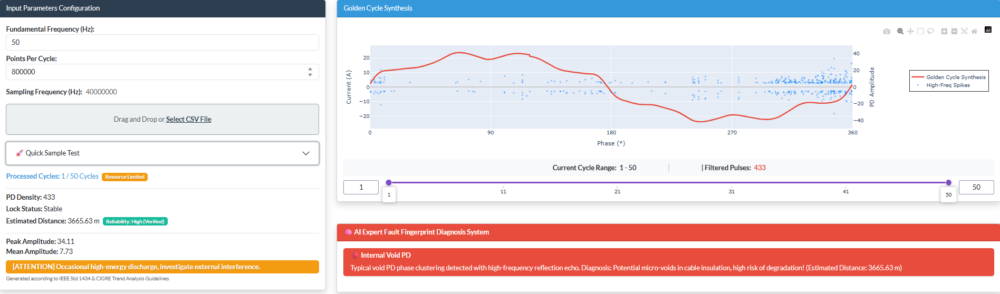
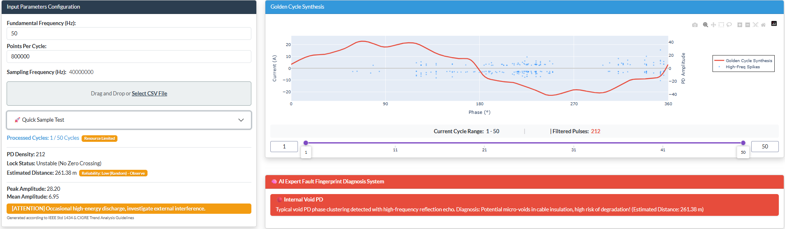
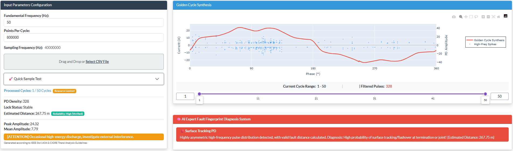

# ⚡ HE-PDA (High-Frequency Edge-Side Partial Discharge Analyzer)


**Edge-Based High-Frequency Partial Discharge Analysis**

**HE-PDA** is a professional diagnostic platform for high-frequency transient signal processing and Partial Discharge (PD) analysis. By moving complex feature extraction directly to the edge, it converts high-frequency physical phenomena into automated, actionable insights. It provides a robust, efficient solution for assessing the insulation health of high-voltage cables and power equipment.

<div align="center">
  
  <br/><em>▲ Phase 0 View: Hardware-accelerated PRPD spectrum and expert diagnostics.</em>
  <br/><br/>
  
  <br/><em>▲ Phase 1 View: Tracing micro-features across different insulation states.</em>
  <br/><br/>
  
  <br/><em>▲ Phase 2 View: Background noise stripping and interference analysis.</em>
</div>

## ✨ Key Features

- **🚀 Efficient Edge-Side Feature Extraction (OOM-Resistant)**: Proven at sampling rates from **500KHz to 80MHz (HF/VHF)**. The "dimensionless filtering" architecture is built to scale up to **UHF (300MHz+)**. By using SOS-cascaded high-pass filters and adaptive max-pooling, the system converts massive raw datasets into sparse PD events while keeping memory usage extremely low—making it ideal for constrained hardware like the STM32.
- **📊 Hardware-Accelerated Visualization**: Powered by Dash and Plotly WebGL, the platform provides lag-free rendering for 100,000+ data points (50-cycle accumulation). Features include multi-cycle dynamic drill-down and microscopic evolution tracing for PRPD patterns.
- **🧠 Explainable Expert Diagnostics**: Built on IEEE 1434 and CIGRE standards, our system moves beyond "black box" models. It uses 6-sigma dynamic noise stripping and decision trees to reliably identify internal voids, surface tracking, floating potentials, and inverter-switching noise.
- **📍 Intelligent TDR Echo Location**: Automatically detects dual-end reflected waves to calculate defect locations and provides a reliability score based on phase-locking status.
- **🐳 One-Click Reporting & Deployment**: Export full diagnostic reports (Diagnostic_Report.html) instantly. Includes a native `Dockerfile` for containerized deployment on Linux/Windows servers or edge gateways.

## 📦 Ready-to-Use Datasets

The platform includes built-in high-frequency samples for immediate testing. For deep validation or secondary development, we provide access to **8,000+ sets of high-quality PD waveforms (80MHz, single-cycle)**:
- 🔗 [Kaggle Official Dataset (VSB Power Line Fault Detection)](https://www.kaggle.com/competitions/vsb-power-line-fault-detection/data)
- 🔗 [Author's Google Drive Backup](https://drive.google.com/drive/folders/1GH7KxsQyumzmdKEg-hwQZOdgAETmBsQ5?usp=sharing)

##  Update History

### v1.0.0
- **🚀 PDA Diagnosis Engine - Version 1.0.0**: First stable release of the Partial Discharge Diagnosis Engine (PDA).
- **Standalone Binary**: Fully self-contained execution; no Python environment or library installation is required on the host system. Built using Nuitka.
- **Advanced Signal Processing**: Integrated with optimized scipy and numpy stacks for high-frequency partial discharge (PD) signal analysis and filtering.
- **Interactive Visualization**: Built with Dash and Plotly to provide a real-time, responsive diagnostic dashboard.
- **Production Ready**: Specifically tuned for 1GB RAM Ubuntu 22.04 VPS environments with a focus on memory stability.
- **Documentation Update**: Updated the Quick Start guide to reflect the new standalone binary release deployment process.

## 🚀 Quick Start

### 🛠 Deployment Instructions (Ubuntu 22.04+)

1. Download the `he_pda_engine` from the Release Assets section.
2. Grant execution permissions:
   ```bash
   chmod +x he_pda_engine
   ```
3. Run the engine:
   - For direct testing:
     ```bash
     ./he_pda_engine
     ```
   - For background production (recommended):
     ```bash
     nohup ./he_pda_engine > app.log 2>&1 &
     ```

**📝 Notes:**
- The default service port is **8052**. Please ensure this port is open in your VPS firewall/security group settings.
- If you encounter a `libglib` error on a fresh Ubuntu install, run: 
  ```bash
  sudo apt update && sudo apt install -y libglib2.0-0
  ```