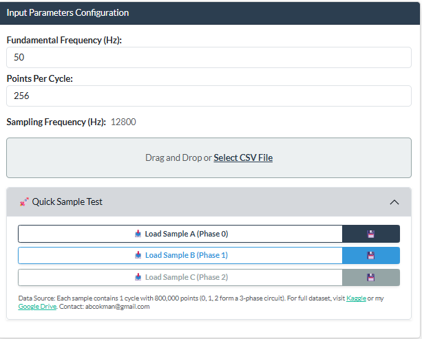
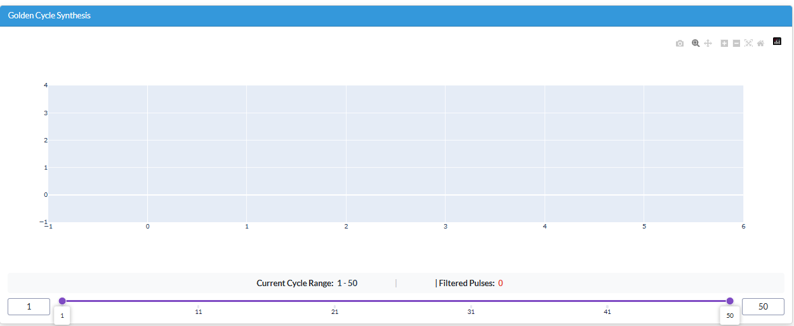
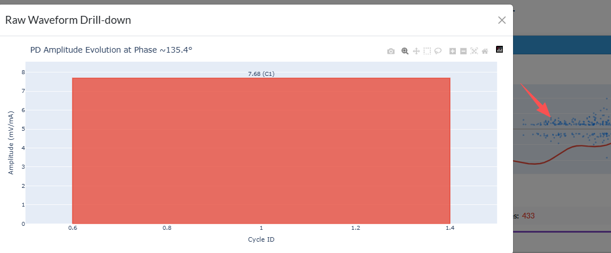
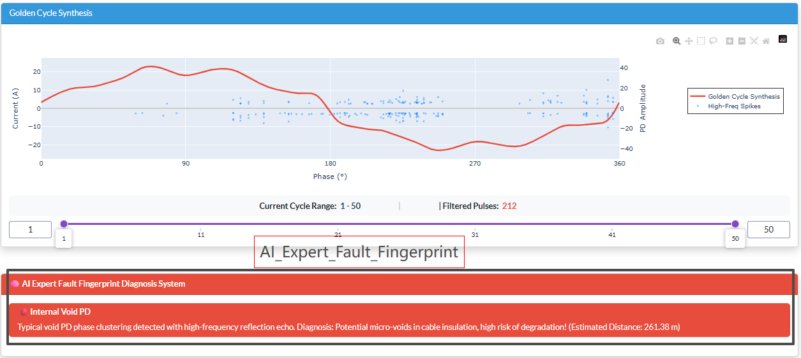

# ⚡ HE-PDA Integrated Analysis Platform - User Manual

Welcome to the **HE-PDA (High-Frequency Edge-Side Partial Discharge Analyzer)** Integrated Analysis Platform. This manual will guide you step-by-step through the process of importing waveform data, configuring analysis parameters, using interactive charts for microscopic feature tracing, and finally generating an AI expert diagnostic report.

---

## 📌 Core Operation Flowchart

1️⃣ **Data Access** ➡️ 2️⃣ **Cycle Range Filtering** ➡️ 3️⃣ **Chart Drill-down Analysis** ➡️ 4️⃣ **Get Diagnosis Report**

---

## Step 1: Configure Basic Parameters and Access Data

The platform supports two methods for data access: local CSV upload and preset standard sample testing.

### 1. Set System Parameters
In the **[Input Parameter Configuration]** section on the left panel, the following parameters must be accurately configured to ensure correct analysis:
*   **Power Frequency (Hz)**: The AC frequency of the current grid (usually 50Hz in China/Europe, 60Hz in North America, etc.).
*   **Points Per Cycle (PPC)**: Fill this in based on your hardware sampling rate. Formula: `PPC = Actual Hardware Sampling Rate / Power Frequency`. (e.g., if the sampling rate is 40MHz and the power frequency is 50Hz, then PPC = 800,000).

### 2. Choose Data Loading Method
*   **Method A - Drag and Drop Upload**: Drag your measured `.csv` transient waveform file into the dashed box. **⚠️ Data Format Requirement**: CSV files should include headers. The system automatically identifies columns containing keywords like `phase`, `A`, `B`, `C`, or `Current` as analysis targets. If no headers exist, the system defaults to the first column.
*   **Method B - Preset Single-Cycle Sample Test**: Expand the **[🚀 Quick Test with Preset Samples]** panel and click to load high-definition three-phase fault data with one click (Note: These built-in samples contain only 1 power frequency cycle due to the extremely high sampling rate).
*   **Method C - Download Standard Test Samples**: In the "Quick Test" panel, you can also click the **💾 Download** icon next to each sample to download original files like `phase_0_data.csv`. You can open these with Excel to view the raw data structure at an 80MHz sampling rate or use them to test Method A.
*   **Method D - Get Full Open Source Dataset (8000+ Samples)**: If you require deep algorithm verification or batch feature analysis, you can download the full 80MHz single-cycle high-quality PD waveform dataset (8000+ sets) via:
    - 🔗 [Kaggle Official Competition Dataset (VSB Power Line Fault Detection)](https://www.kaggle.com/competitions/vsb-power-line-fault-detection/data)
    - 🔗 [Author's Google Drive Backup](https://drive.google.com/drive/folders/1GH7KxsQyumzmdKEg-hwQZOdgAETmBsQ5?usp=sharing)

  
   
  <em>▲ Left side: Data access and parameter configuration area</em>

---

## Step 2: Interpret PRPD Main Chart and Dynamic Drill-down

Once data is loaded, the large main chart area on the right is your core analysis field.

### 1. Dual Y-axis PRPD Pattern
*   **Red Smooth Curve**: Represents the extracted absolute power frequency fundamental signal (referenced to the left Y-axis: Current(A)).
*   **Blue Scatter Cloud**: Represents high-frequency partial discharge (PD) pulse points (referenced to the right Y-axis: PD Amplitude).
*   **Environmental Noise Annotation**: If pulses are locked to mechanical vibration phases (e.g., near switching angles), the chart automatically displays an orange `Environment Noise` label to prevent misjudgment.

### 2. 50-Cycle Timeline Range Slider
A blue **Range Slider** is located below the chart.
*   By default, it shows accumulated points from the 1st to the 50th power frequency cycle.
*   *Note: If the imported data is shorter than 50 cycles (like preset samples), the slider automatically adjusts to the maximum available cycles.*
*   By dragging the slider (e.g., to 15 - 30), the chart instantly hides excluded parts, and the **red pulse count badge** at the bottom right updates in real-time to show valid discharges, helping you precisely isolate sporadic interference.

  
   
  <em>▲ Top right: Main chart area, supporting multi-cycle filtering via the slider</em>

### 3. Microscopic Trace Drill-down
In the PRPD chart, **click any blue suspicious discharge point with your mouse**, and a `Raw Waveform Drill-down` window will immediately pop up.
*   The system locks onto the absolute phase angle of that point (e.g., 45.2°).
*   An intuitive **stacked evolution bar chart** shows how the PD amplitude at that specific phase has grown from nothing to something, or weak to strong, over the 50 cycles.

  
   
  <em>▲ After clicking a scatter point, you can drill down to see the amplitude evolution history of a specific phase</em>

---

## Step 3: View AI Expert System Diagnosis and Reports

The platform requires no manual lookup; the built-in algorithm engine deduces fault physics logic in the background.

### 1. Metrics Overview
Located at the bottom left, providing core health indicators for the cable:
*   **RMS Comparison**: Visually displays energy loss before and after filtering to determine the interference deviation rate.
*   **Lock Status**: Intelligently determines if pulse features show regular phase-locking (Stable/Random).
*   **TDR Location**: If dual-end reflected waves are detected, it automatically calculates the defect distance in meters and provides a reliability rating badge. *(Note: Calculations are based on a typical XLPE wave velocity of 170 m/μs)*.

### 2. 🧠 AI Expert Diagnosis Card
Located at the bottom right, the system generates an authoritative diagnosis based on extracted fingerprint features:
*   🟢 **Green Badge**: Good insulation, no abnormal discharge detected.
*   🟡 **Yellow Warning**: Detected high-frequency inverter switching noise, external corona white noise, or suspected floating potential in the shield layer.
*   🔴 **Red Alert**: High-risk sign of insulation breakdown! Diagnosed as **Internal Void PD** or **Surface Tracking**, usually accompanied by a strong recommendation for power-off maintenance.

  
   
  <em>▲ Bottom right: AI expert diagnosis card, providing conclusions based on pattern features</em>

### 3. One-click Report Generation
After analysis, click the green **"📄 Generate Report"** button at the very bottom of the page.
The browser will automatically download a `Diagnostic_Report.html` file, which packages the core quantitative parameters and complete expert diagnostic recommendations for archiving, printing, or sending to O&M decision-makers.

---

## ❓ FAQ (Frequently Asked Questions)

**Q1: The chart is empty after uploading CSV, or the red fundamental curve is just a flat line?**
*   **Reason**: Usually, the `PPC (Points Per Cycle)` entered does not match the actual sampling rate of the data, causing the system to fail in capturing a single cycle correctly.
*   **Solution**: Check the sampling rate of your raw data and recalculate `PPC` (Sampling Rate / 50).

**Q2: Why does the system throw a `ValueError` when parsing uploaded data?**
*   **Reason**: The CSV might contain unparseable text or a large number of `NaN` (null) values; or the number of data points after slicing is too small (< 15 points).
*   **Solution**: Open the CSV in Excel, remove non-numeric rows, and ensure the data in the first column or column with the `phase` header consists of clean floating-point numbers.